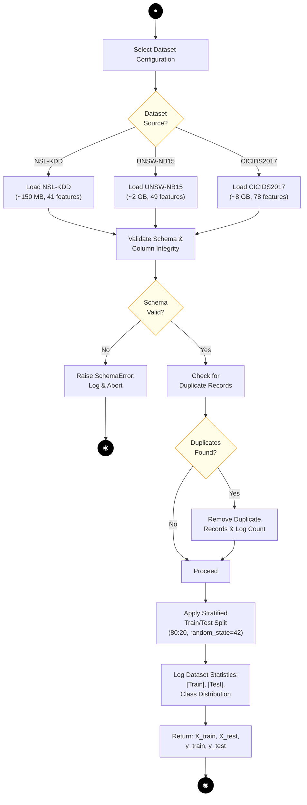
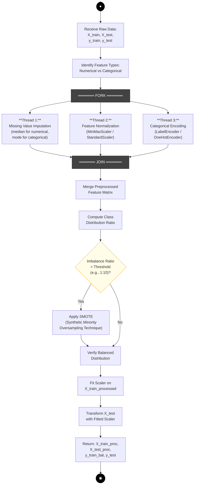
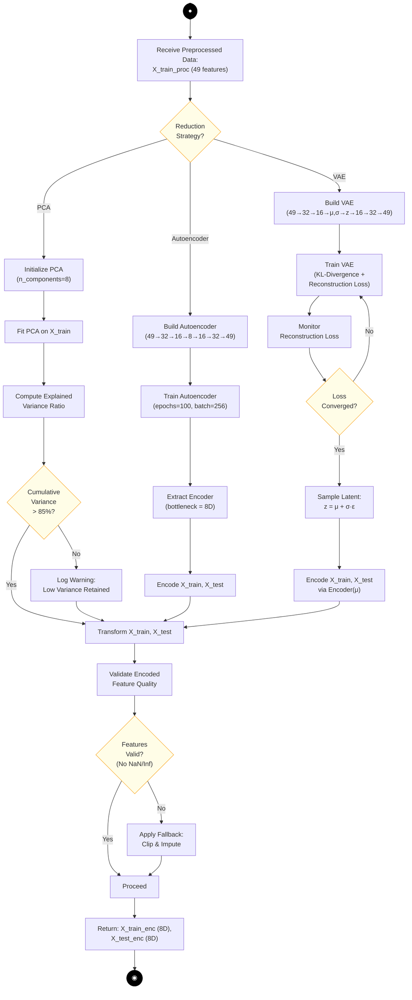
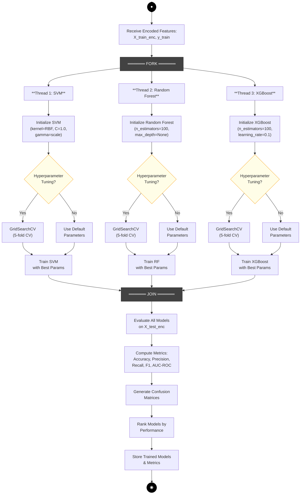
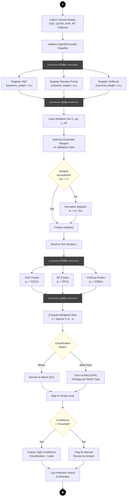
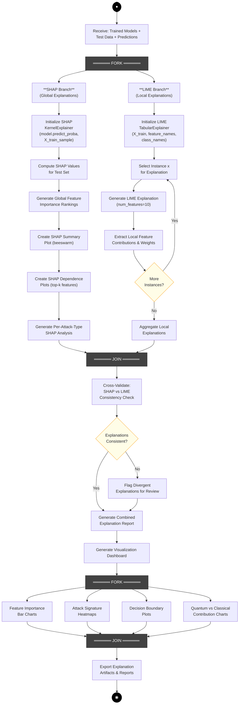

```mermaid
flowchart TD
    S(["●"]) --> A1["Receive Encoded Features<br/>X_train_enc (8D)"]

    A1 --> A2["Select Quantum Backend"]
    A2 --> D1{"Backend<br/>Type?"}
    D1 -- Simulator --> A3["Initialize Aer Simulator<br/>(statevector_simulator)"]
    D1 -- Real Hardware --> A4["Load IBMQ Account<br/>& Select Backend<br/>(ibm_brisbane, 127 qubits)"]

    A3 --> A5["Configure Shots<br/>(n_shots = 1024)"]
    A4 --> A5

    A5 --> A6["Build Quantum Feature Map"]
    A6 --> D2{"Feature Map<br/>Type?"}
    D2 -- ZZFeatureMap --> A7["ZZFeatureMap<br/>(dim=8, reps=2)"]
    D2 -- ZFeatureMap --> A8["ZFeatureMap<br/>(dim=8, reps=2)"]

    A7 --> A9["Select Entanglement Pattern"]
    A8 --> A9
    A9 --> D3{"Entanglement?"}
    D3 -- Linear --> A10["Linear Entanglement"]
    D3 -- Circular --> A11["Circular Entanglement"]
    D3 -- Full --> A12["Full Entanglement"]

    A10 --> A13["Build Trainable Ansatz"]
    A11 --> A13
    A12 --> A13

    A13 --> D4{"Ansatz<br/>Type?"}
    D4 -- RealAmplitudes --> A14["RealAmplitudes<br/>(qubits=8, reps=3)"]
    D4 -- EfficientSU2 --> A15["EfficientSU2<br/>(qubits=8, reps=3)"]

    A14 --> A16["Compose Full Circuit:<br/>Feature Map + Ansatz"]
    A15 --> A16

    A16 --> D5{"Classifier<br/>Type?"}
    D5 -- VQC --> A17["Initialize VQC<br/>(optimizer=COBYLA,<br/>maxiter=100)"]
    D5 -- QSVM --> A18["Compute Quantum Kernel<br/>Matrix K(xi, xj)"]

    A17 --> A19["Train VQC:<br/>Optimize θ Parameters"]
    A19 --> A20["Monitor Loss Convergence"]
    A20 --> D6{"Converged /<br/>maxiter reached?"}
    D6 -- No --> A19
    D6 -- Yes --> A21["Store Trained Parameters θ*"]

    A18 --> A22["Train Classical SVM<br/>with Quantum Kernel"]
    A22 --> A21

    A21 --> A23["Predict on X_test_enc"]
    A23 --> A24["Compute Quantum<br/>Model Metrics"]
    A24 --> E(["◉"])

    style S fill:#000,stroke:#000,color:#fff
    style E fill:#000,stroke:#000,color:#fff
    style D1 fill:#fffde7,stroke:#f9a825
    style D2 fill:#fffde7,stroke:#f9a825
    style D3 fill:#fffde7,stroke:#f9a825
    style D4 fill:#fffde7,stroke:#f9a825
    style D5 fill:#fffde7,stroke:#f9a825
    style D6 fill:#fffde7,stroke:#f9a825
```

```mermaid
flowchart TD
    S(["●"]) --> A1["System Initialization:<br/>Load Configuration"]

    A1 --> A2["**MODULE 1:**<br/>Data Loading &<br/>Dataset Management"]
    A2 --> D1{"Dataset<br/>Available?"}
    D1 -- No --> A2a["Download / Fetch<br/>Dataset from Source"]
    D1 -- Yes --> A3["Validate Schema & Integrity"]
    A2a --> A3
    A3 --> A4["Stratified Train/Test Split (80:20)"]

    A4 --> A5["**MODULE 2:**<br/>Data Preprocessing &<br/>Class Balancing"]

    A5 --> FK1["══════ FORK ══════"]
    FK1 --> P1["Missing Value Imputation"]
    FK1 --> P2["Feature Normalization"]
    FK1 --> P3["Categorical Encoding"]
    P1 --> JN1["══════ JOIN ══════"]
    P2 --> JN1
    P3 --> JN1

    JN1 --> D2{"Class<br/>Imbalanced?"}
    D2 -- Yes --> A6["Apply SMOTE Oversampling"]
    D2 -- No --> A7["Proceed"]
    A6 --> A7

    A7 --> A8["**MODULE 3:**<br/>Feature Engineering &<br/>Dimensionality Reduction"]
    A8 --> D3{"Reduction<br/>Method?"}
    D3 -- PCA --> R1["PCA (49→8)"]
    D3 -- Autoencoder --> R2["AE (49→8)"]
    D3 -- VAE --> R3["VAE (49→8)"]
    R1 --> A9["Validate Encoded Features"]
    R2 --> A9
    R3 --> A9

    A9 --> FK2["══════ FORK ══════"]

    FK2 --> CL["**MODULE 4:**<br/>Classical Model Training"]
    FK2 --> QP["**MODULE 5:**<br/>Quantum Processing"]

    CL --> FK3["══ FORK ══"]
    FK3 --> M1["Train SVM (RBF)"]
    FK3 --> M2["Train RF (100 trees)"]
    FK3 --> M3["Train XGBoost"]
    M1 --> JN3["══ JOIN ══"]
    M2 --> JN3
    M3 --> JN3

    QP --> Q1["Build Quantum Circuit<br/>(ZZFeatureMap + RealAmplitudes)"]
    Q1 --> D4{"Classifier?"}
    D4 -- VQC --> Q2["Train VQC (COBYLA, 100 iter)"]
    D4 -- QSVM --> Q3["Compute Quantum Kernel & Train"]
    Q2 --> Q4["Store θ*"]
    Q3 --> Q4

    JN3 --> JN2["══════ JOIN ══════"]
    Q4 --> JN2

    JN2 --> A10["**MODULE 6:**<br/>Hybrid Ensemble Classification"]
    A10 --> A11["Weighted Voting: ŷ = argmax Σwᵢpᵢ"]
    A11 --> D5{"Mode?"}
    D5 -- Binary --> A12["Normal vs Attack"]
    D5 -- Multi-class --> A13["One-vs-Rest per Attack Type"]
    A12 --> A14["Final Prediction"]
    A13 --> A14

    A14 --> A15["**MODULE 7:**<br/>Explainability (XAI)"]

    A15 --> FK4["══════ FORK ══════"]
    FK4 --> X1["SHAP: Global Feature Importance"]
    FK4 --> X2["LIME: Local Instance Explanations"]
    X1 --> JN4["══════ JOIN ══════"]
    X2 --> JN4

    JN4 --> A16["Generate Explanation<br/>Report & Visualizations"]
    A16 --> A17["Output: Classification Result<br/>+ XAI Report + Threat Assessment"]
    A17 --> E(["◉"])

    style S fill:#000,stroke:#000,color:#fff
    style E fill:#000,stroke:#000,color:#fff
    style FK1 fill:#424242,stroke:#212121,color:#fff
    style JN1 fill:#424242,stroke:#212121,color:#fff
    style FK2 fill:#424242,stroke:#212121,color:#fff
    style JN2 fill:#424242,stroke:#212121,color:#fff
    style FK3 fill:#424242,stroke:#212121,color:#fff
    style JN3 fill:#424242,stroke:#212121,color:#fff
    style FK4 fill:#424242,stroke:#212121,color:#fff
    style JN4 fill:#424242,stroke:#212121,color:#fff
    style D1 fill:#fffde7,stroke:#f9a825
    style D2 fill:#fffde7,stroke:#f9a825
    style D3 fill:#fffde7,stroke:#f9a825
    style D4 fill:#fffde7,stroke:#f9a825
    style D5 fill:#fffde7,stroke:#f9a825
```

# Activity Diagrams — Module-Wise

## Explainable Hybrid Quantum-Classical Network Intrusion Detection System Using Variational Quantum Circuits

---

## Table of Contents

1. [UML Activity Diagram Notation Reference](#1-uml-activity-diagram-notation-reference)
2. [Module 1 — Data Loading & Dataset Management](#2-module-1--data-loading--dataset-management)
3. [Module 2 — Data Preprocessing & Class Balancing](#3-module-2--data-preprocessing--class-balancing)
4. [Module 3 — Feature Engineering (Dimensionality Reduction)](#4-module-3--feature-engineering-dimensionality-reduction)
5. [Module 4 — Classical Model Training & Baseline Evaluation](#5-module-4--classical-model-training--baseline-evaluation)
6. [Module 5 — Quantum Processing (VQC / QSVM Training)](#6-module-5--quantum-processing-vqc--qsvm-training)
7. [Module 6 — Hybrid Ensemble Classification](#7-module-6--hybrid-ensemble-classification)
8. [Module 7 — Explainability Engine (XAI — SHAP + LIME)](#8-module-7--explainability-engine-xai--shap--lime)
9. [Overall System Activity Diagram](#9-overall-system-activity-diagram)
10. [Cross-Reference: Modules to Classes](#10-cross-reference-modules-to-classes)

---

## 1. UML Activity Diagram Notation Reference

The following standard UML 2.5 notation elements are used throughout these diagrams (as per OMG UML Specification and standard software engineering textbooks — Pressman, Sommerville, Booch et al.):

| Symbol                   | Name                              | Description                                                                                                                         |
| ------------------------ | --------------------------------- | ----------------------------------------------------------------------------------------------------------------------------------- |
| ● (Filled Circle)        | **Initial Node**                  | The single starting point of the activity. Every activity diagram has exactly one initial node.                                     |
| ◉ (Bull's Eye)           | **Activity Final Node**           | Marks the termination of the entire activity. All flows and tokens are destroyed.                                                   |
| ▭ (Rounded Rectangle)    | **Action State / Activity State** | Represents an atomic action or a sub-activity that cannot be decomposed further within this diagram.                                |
| ◇ (Diamond)              | **Decision Node**                 | A branch point where the flow is split into multiple outgoing paths based on a guard condition. Exactly one outgoing path is taken. |
| ◇ (Diamond, merging)     | **Merge Node**                    | Joins multiple alternative flows back into a single flow. Does NOT synchronize — simply passes whichever token arrives.             |
| ═══ FORK ═══ (Thick Bar) | **Fork Node**                     | Splits a single flow into multiple **concurrent** (parallel) flows. All outgoing branches execute simultaneously.                   |
| ═══ JOIN ═══ (Thick Bar) | **Join Node**                     | Synchronization bar — waits for **all** incoming concurrent flows to complete before a single outgoing flow continues.              |
| → (Arrow)                | **Control Flow / Edge**           | Represents the flow of control from one action to the next.                                                                         |
| [condition]              | **Guard Condition**               | A Boolean expression on a control flow edge leaving a decision node. Written in square brackets.                                    |
| ↻ (Loop-back arrow)      | **Iteration / Loop**              | A control flow edge that loops back to an earlier action, representing repetition until a condition is met.                         |

### Key Modeling Conventions Used

1. **Fork/Join Pairs**: Every fork has a matching join. Concurrent threads between fork–join execute in true parallelism.
2. **Decision/Merge Pairs**: Every decision diamond has a corresponding merge point (explicit or implicit). Guard conditions on outgoing edges are mutually exclusive and collectively exhaustive.
3. **Swimlanes**: Not used in individual module diagrams (each module is self-contained). The overall system diagram shows module boundaries instead.
4. **Object Flows**: Data objects passed between actions are shown as labels on actions (e.g., `X_train_enc (8D)`) rather than separate object nodes, for readability.
5. **Nested Activities**: Each module diagram can be considered a sub-activity that is invoked by the overall system activity diagram.

---

## 2. Module 1 — Data Loading & Dataset Management

### Purpose

Load raw network intrusion datasets, validate data integrity, and partition into training and testing subsets using stratified sampling.

### Participating Classes

- `DataLoader`, `DatasetConfig`, `NIDSPipeline`

### Activity Diagram

### Narrative Description

1. **Initial Node → Select Dataset Configuration**: The activity begins when the system (via `NIDSPipeline`) triggers data loading with a specific `DatasetConfig`.
2. **Decision: Dataset Source?**: Based on the configuration, the system routes to one of three dataset loading paths — NSL-KDD (41 features), UNSW-NB15 (49 features, primary dataset), or CICIDS2017 (78 features).
3. **Validate Schema**: After loading, schema validation ensures all expected columns are present with correct data types. If validation fails, a `SchemaError` is raised and the activity terminates at an **Activity Final Node** (abnormal termination).
4. **Duplicate Check → Remove**: Optional deduplication step — if duplicates exist, they are removed and the count is logged.
5. **Stratified Split**: The data is split into 80% training and 20% testing sets using stratified sampling to preserve class distribution (critical given class imbalance in intrusion datasets).
6. **Activity Final Node**: Returns the four data partitions (`X_train`, `X_test`, `y_train`, `y_test`) and terminates.

---

## 3. Module 2 — Data Preprocessing & Class Balancing

### Purpose

Clean, normalize, and encode raw features; address class imbalance through synthetic oversampling.

### Participating Classes

- `DataPreprocessor`, `SMOTEBalancer`, `DataLoader`

### Activity Diagram

### Narrative Description

1. **Receive Raw Data**: The module accepts the four partitions from Module 1.
2. **Fork (Concurrent Preprocessing)**: Three independent preprocessing operations execute in parallel:
   - **Thread 1**: Missing values are imputed using median (numerical) or mode (categorical).
   - **Thread 2**: Numerical features are normalized to [0, 1] range using `MinMaxScaler`.
   - **Thread 3**: Categorical features are encoded into numerical representations.
3. **Join (Synchronization)**: All three threads must complete before merging the preprocessed feature matrix.
4. **Decision: Class Imbalance?**: The class distribution ratio is computed. If the minority-to-majority ratio exceeds a threshold (e.g., 1:10), **SMOTE** is applied to generate synthetic minority samples.
5. **Scaler Fitting**: The scaler is fit only on `X_train` (to prevent data leakage), then applied to transform `X_test`.
6. **Activity Final Node**: Returns preprocessed and balanced datasets.

**UML Construct Highlight**: The **Fork/Join** pair models the concurrent execution of three independent preprocessing pipelines, which is a key parallelism pattern in UML activity diagrams.

---

## 4. Module 3 — Feature Engineering (Dimensionality Reduction)

### Purpose

Reduce the high-dimensional feature space (49 features for UNSW-NB15) down to 8 features suitable for quantum circuit encoding (8 qubits).

### Participating Classes

- `FeatureReducer` (interface), `PCAReducer`, `AutoencoderReducer`, `VAEReducer`

### Activity Diagram

### Narrative Description

1. **Decision: Reduction Strategy?**: The system selects one of three dimensionality reduction approaches based on the `FeatureReducer` strategy pattern:
   - **PCA**: Linear reduction; checks if 8 components retain ≥85% cumulative variance.
   - **Autoencoder**: Non-linear reduction through a symmetric encoder-decoder neural network with an 8-neuron bottleneck.
   - **VAE (Primary)**: Variational Autoencoder that learns a probabilistic latent space; trained using combined KL-divergence and reconstruction loss.
2. **Iteration (VAE Training Loop)**: The VAE training includes a convergence loop — the activity loops back from the loss convergence check to the training step if the loss has not converged. This is a standard **iteration** construct in UML activity diagrams.
3. **Decision: Variance Check (PCA)**: For PCA, if cumulative explained variance is below 85%, a warning is logged but execution continues (degraded mode).
4. **Validation Gate**: After encoding, features are validated for numerical integrity (no NaN/Inf values). A fallback mechanism clips and imputes if necessary.
5. **Activity Final Node**: Returns 8-dimensional encoded features for both train and test sets.

**UML Construct Highlight**: The three-way **Decision Node** demonstrates how the Strategy design pattern maps to UML — each branch represents a concrete strategy implementation.

**Design Pattern**: Strategy Pattern — `FeatureReducer` interface with `PCAReducer`, `AutoencoderReducer`, and `VAEReducer` as concrete strategies.

---

## 5. Module 4 — Classical Model Training & Baseline Evaluation

### Purpose

Train three classical machine learning models in parallel to establish performance baselines and contribute to the hybrid ensemble.

### Participating Classes

- `BaseClassifier` (abstract), `SVMClassifier`, `RandomForestClassifier`, `XGBoostClassifier`, `ModelEvaluator`

### Activity Diagram

### Narrative Description

1. **Fork (Parallel Training)**: Three classical ML models are trained concurrently:
   - **Thread 1 — SVM**: Support Vector Machine with RBF kernel.
   - **Thread 2 — Random Forest**: Ensemble of 100 decision trees.
   - **Thread 3 — XGBoost**: Gradient-boosted decision trees.
2. **Decision (per thread): Hyperparameter Tuning?**: Each thread independently decides whether to perform `GridSearchCV` (5-fold cross-validation) for hyperparameter optimization. This demonstrates **nested decisions within concurrent flows**.
3. **Join (Synchronization)**: Training completes only when all three models have finished. The join bar enforces this synchronization.
4. **Sequential Evaluation**: After the join, models are evaluated sequentially on the test set. Metrics include Accuracy, Precision, Recall, F1-Score, and AUC-ROC.
5. **Activity Final Node**: Trained models and their evaluation metrics are stored for ensemble integration.

**UML Construct Highlight**: **Fork/Join with internal Decision Nodes** — each concurrent thread contains its own decision logic, demonstrating that concurrent flows can have arbitrarily complex internal control flow.

**Design Pattern**: Template Method — `BaseClassifier` defines `train()` → `tune()` → `evaluate()` template; subclasses override specific steps.

---

## 6. Module 5 — Quantum Processing (VQC / QSVM Training)

### Purpose

Build and train quantum machine learning models using parameterized quantum circuits on encoded features.

### Participating Classes

- `QuantumCircuitBuilder`, `VQCClassifier`, `QSVMClassifier`, `QuantumBackendManager`

### Activity Diagram

### Narrative Description

1. **Backend Selection (Decision)**: The system selects between a local Aer simulator (for development/testing) and IBM Brisbane real quantum hardware (for production benchmarking).
2. **Feature Map Construction (Two Decisions)**: The quantum feature map is configured through two successive decisions:
   - Feature map type (ZZFeatureMap or ZFeatureMap)
   - Entanglement pattern (Linear, Circular, or Full)
3. **Ansatz Selection (Decision)**: The trainable ansatz is selected — RealAmplitudes (default) or EfficientSU2.
4. **Circuit Composition**: The full parameterized quantum circuit is composed by concatenating the feature map and ansatz.
5. **Classifier Branch (Decision)**: Two quantum classifier approaches:
   - **VQC**: Variational Quantum Classifier — iteratively optimizes rotation parameters θ using COBYLA optimizer with a maximum of 100 iterations.
   - **QSVM**: Quantum Support Vector Machine — computes a quantum kernel matrix and passes it to a classical SVM.
6. **Training Loop (VQC)**: The VQC training includes a convergence loop that iterates until loss converges or maximum iterations are reached. This is the **iteration construct** in UML.
7. **Activity Final Node**: Returns trained quantum model parameters and evaluation metrics.

**UML Construct Highlight**: **Multiple cascading Decision Nodes** — the sequential chain of decisions (Backend → Feature Map → Entanglement → Ansatz → Classifier) creates a configuration pipeline where each decision constrains the next.

**Design Pattern**: Builder Pattern — `QuantumCircuitBuilder` constructs the circuit step-by-step (feature map → entanglement → ansatz → compose).

---

## 7. Module 6 — Hybrid Ensemble Classification

### Purpose

Combine quantum and classical model predictions through weighted voting to produce the final classification decision.

### Participating Classes

- `HybridEnsemble`, `EnsembleConfig`, `VQCClassifier`, `RandomForestClassifier`, `XGBoostClassifier`

### Activity Diagram

### Narrative Description

1. **Model Registration (Fork/Join)**: All trained models are registered with the `HybridEnsemble` concurrently, each with an initial weight.
2. **Weight Optimization**: Ensemble weights are optimized on a validation set to maximize combined performance. Weights are normalized so that $\sum w_i = 1$.
3. **Parallel Prediction (Fork/Join)**: For each test sample, all three constituent models predict concurrently. The join synchronizes all predictions before the voting step.
4. **Weighted Voting**: Final prediction is computed as $\hat{y} = \arg\max \sum w_i \cdot p_i$, where $p_i$ is the probability vector from model $i$.
5. **Classification Mode Decision**: The system supports binary (Normal vs Attack) and multi-class (per attack type using OVR strategy) classification.
6. **Confidence Thresholding**: Low-confidence predictions are flagged for manual review by a security analyst, rather than being silently output.

**UML Construct Highlight**: **Two Fork/Join pairs** — the first for parallel model registration, the second for parallel prediction. This shows that fork/join can be nested or sequential within the same activity.

**Design Pattern**: Composite Pattern — `HybridEnsemble` aggregates multiple `BaseClassifier` instances and treats them uniformly through the same `predict()` interface.

---

## 8. Module 7 — Explainability Engine (XAI — SHAP + LIME)

### Purpose

Generate interpretable explanations for model predictions using global (SHAP) and local (LIME) explainability methods.

### Participating Classes

- `Explainer` (interface), `SHAPExplainer`, `LIMEExplainer`, `ExplanationVisualizer`, `ExplanationReport`

### Activity Diagram

### Narrative Description

1. **Fork (Parallel Explanation)**: Two explainability methods execute concurrently:
   - **SHAP Branch (Global)**: Computes Shapley values across the entire test set to rank features by global importance. Produces beeswarm plots, dependence plots, and per-attack-type analysis.
   - **LIME Branch (Local)**: Generates per-instance explanations by perturbing features and observing prediction changes.
2. **LIME Iteration Loop**: The LIME branch includes an iteration construct — it loops through multiple selected instances, generating local explanations for each. The loop terminates when all selected instances have been explained.
3. **Join + Cross-Validation**: After both branches complete, the system cross-validates SHAP and LIME results for consistency. If SHAP says "Feature A is most important globally" but LIME consistently disagrees at the local level, this divergence is flagged.
4. **Visualization Fork**: Four types of visualizations are generated concurrently:
   - Feature Importance Bar Charts
   - Attack Signature Heatmaps
   - Decision Boundary Plots
   - Quantum vs Classical Contribution Charts
5. **Activity Final Node**: All explanation artifacts and reports are exported.

**UML Construct Highlight**: **Fork with asymmetric internal complexity** — the SHAP branch is a linear sequence while the LIME branch contains an internal iteration loop. This is valid UML — concurrent flows need not be symmetric.

**Design Pattern**: Strategy Pattern — `Explainer` interface with `SHAPExplainer` and `LIMEExplainer` as concrete strategies.

---

## 9. Overall System Activity Diagram

### Purpose

Shows the end-to-end activity flow of the entire NIDS pipeline, from data ingestion to final threat assessment output, with all seven modules integrated.

### Participating Classes

- `NIDSPipeline` (Facade), all module classes

### Activity Diagram

### Narrative Description

1. **System Initialization → Module 1 (Data Loading)**: The pipeline begins by loading and validating the selected dataset, then performing a stratified train/test split.
2. **Module 2 (Preprocessing)**: Three preprocessing operations execute concurrently (Fork/Join), followed by a conditional SMOTE application.
3. **Module 3 (Feature Engineering)**: One of three dimensionality reduction strategies reduces features from 49 to 8 dimensions.
4. **Module 4 ∥ Module 5 (Fork — Classical ∥ Quantum)**: This is the **critical concurrency point** — classical model training and quantum processing execute **in parallel**. This represents the hybrid nature of the system.
   - Module 4 internally forks again to train SVM, RF, and XGBoost concurrently (nested fork/join).
   - Module 5 builds a quantum circuit and trains either VQC or QSVM.
5. **Join (Classical + Quantum)**: Both classical and quantum branches must complete before ensemble integration.
6. **Module 6 (Hybrid Ensemble)**: Weighted voting combines all model predictions. The mode (binary/multi-class) determines the output strategy.
7. **Module 7 (XAI)**: SHAP and LIME execute concurrently to generate explanations.
8. **Final Output**: The system produces a classification result, XAI explanation report, and threat assessment.

**UML Construct Highlight**: **Nested Fork/Join** — the overall diagram contains four fork/join pairs, with Module 4's fork/join nested inside the Module 4–5 fork/join. This is a valid and common UML pattern for expressing hierarchical concurrency.

---

## 10. Cross-Reference: Modules to Classes

| Module                  | Primary Classes                                                                     | Design Pattern  | Key UML Constructs                                              |
| ----------------------- | ----------------------------------------------------------------------------------- | --------------- | --------------------------------------------------------------- |
| M1: Data Loading        | `DataLoader`, `DatasetConfig`                                                       | —               | Decision (3-way), Guard conditions, Exception flow              |
| M2: Preprocessing       | `DataPreprocessor`, `SMOTEBalancer`                                                 | —               | Fork/Join (3 threads), Decision                                 |
| M3: Feature Engineering | `FeatureReducer`, `PCAReducer`, `AutoencoderReducer`, `VAEReducer`                  | Strategy        | Decision (3-way), Iteration (VAE loop)                          |
| M4: Classical Training  | `BaseClassifier`, `SVMClassifier`, `RandomForestClassifier`, `XGBoostClassifier`    | Template Method | Fork/Join (3 threads), Nested decisions                         |
| M5: Quantum Processing  | `QuantumCircuitBuilder`, `VQCClassifier`, `QSVMClassifier`, `QuantumBackendManager` | Builder         | Cascading decisions (5), Iteration (VQC loop)                   |
| M6: Hybrid Ensemble     | `HybridEnsemble`, `EnsembleConfig`                                                  | Composite       | Dual Fork/Join, Decision (3)                                    |
| M7: Explainability      | `SHAPExplainer`, `LIMEExplainer`, `ExplanationVisualizer`, `ExplanationReport`      | Strategy        | Fork/Join (asymmetric), Iteration (LIME loop), Nested Fork/Join |
| Overall System          | `NIDSPipeline` (Facade)                                                             | Facade          | 4 Fork/Join pairs, Nested concurrency                           |

### Summary of UML Activity Diagram Elements Used

| Element                     | Occurrences Across All Diagrams                |
| --------------------------- | ---------------------------------------------- |
| Initial Node (●)            | 8                                              |
| Activity Final Node (◉)     | 9 (Module 1 has 2: normal + error)             |
| Action States               | ~120                                           |
| Decision Nodes              | 22                                             |
| Merge Nodes                 | 18 (implicit at convergence points)            |
| Fork Nodes                  | 10                                             |
| Join Nodes                  | 10                                             |
| Iteration / Loop-back Edges | 3 (VAE training, VQC training, LIME instances) |
| Guard Conditions            | 22                                             |
| Concurrent Threads (max)    | 4 (Module 7 visualization fork)                |

---

_Document prepared following UML 2.5 specification (OMG) and standard software engineering textbook conventions (Pressman — Software Engineering: A Practitioner's Approach; Sommerville — Software Engineering; Booch, Rumbaugh, Jacobson — The Unified Modeling Language User Guide)._
