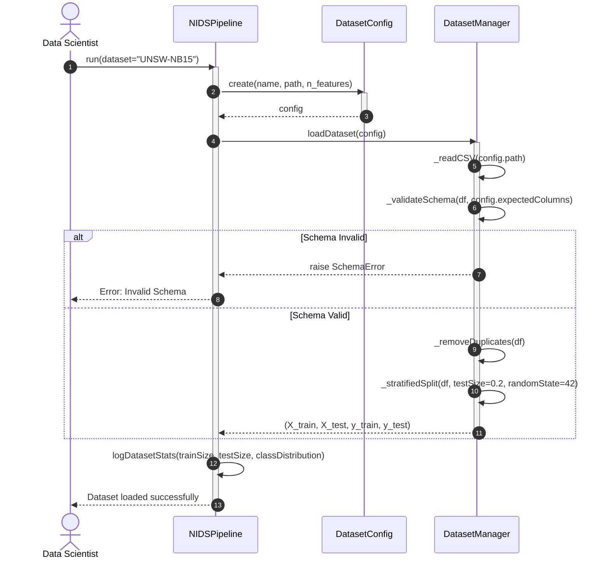
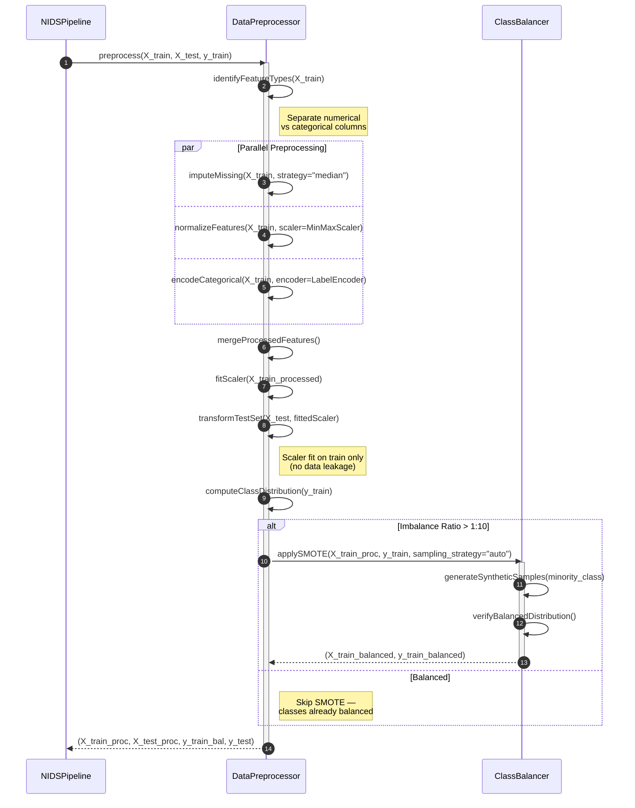
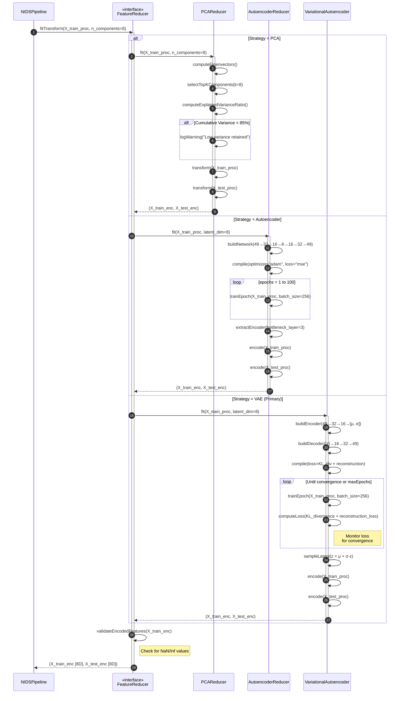
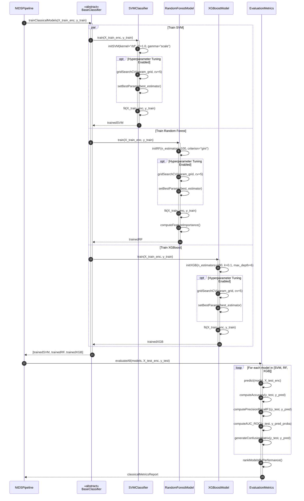
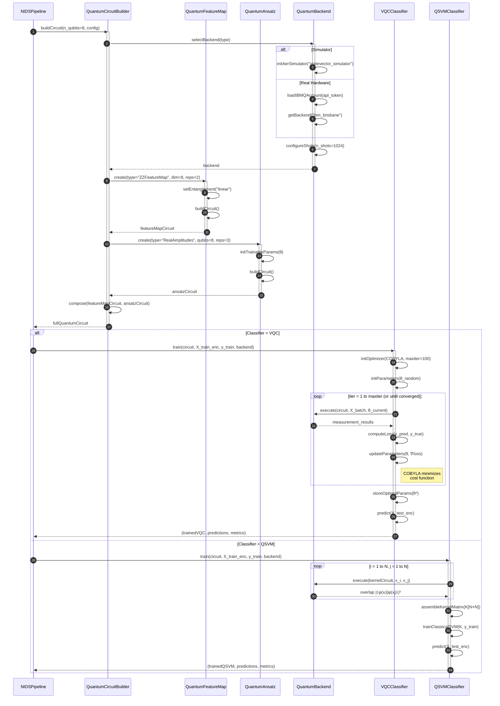
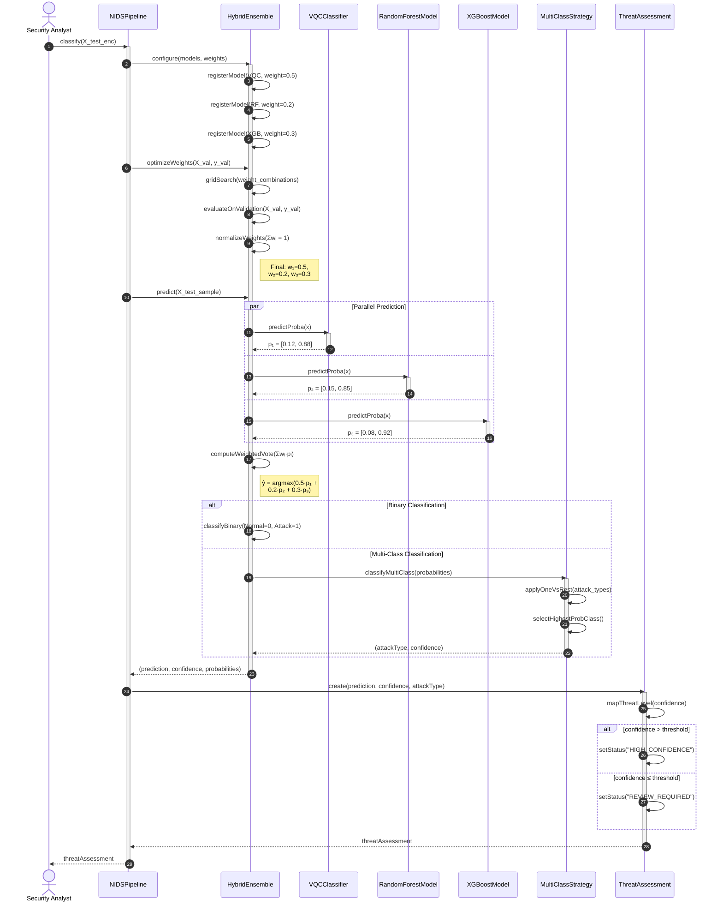
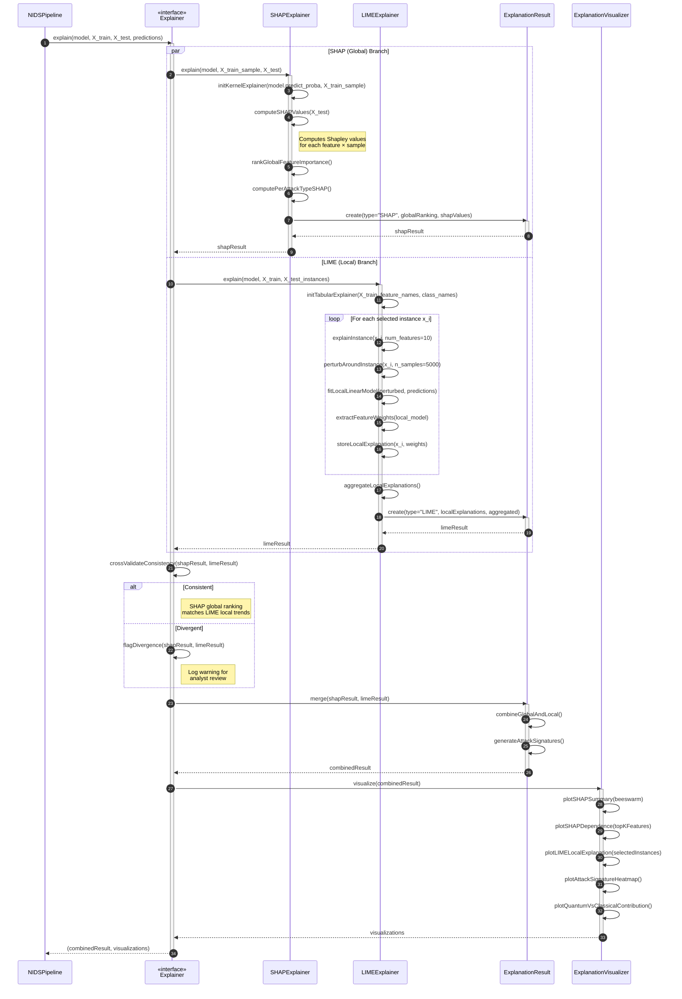
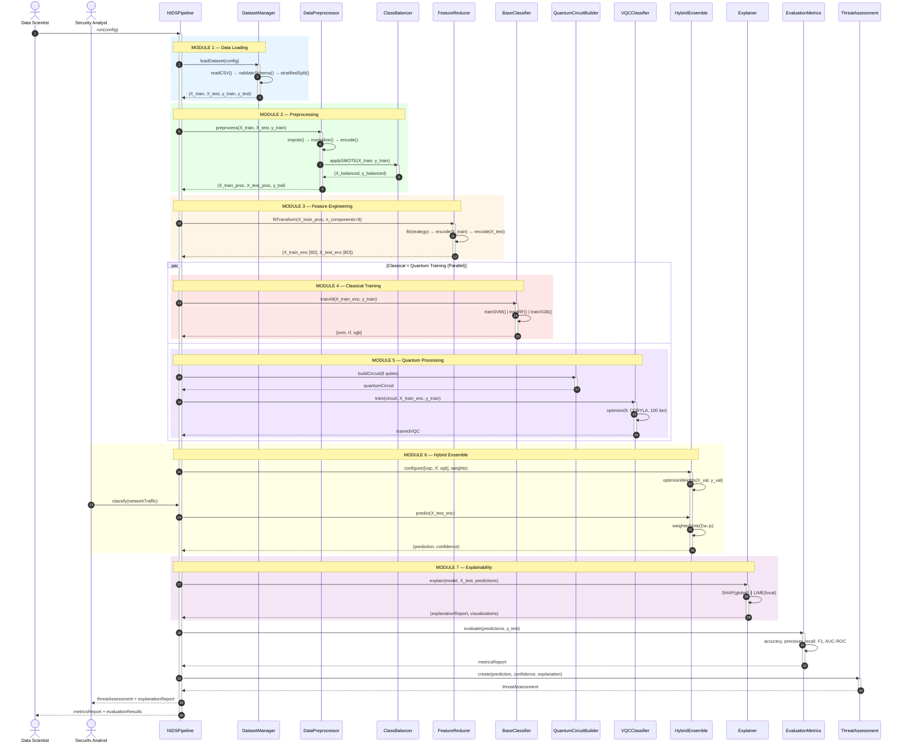

# Sequence Diagrams — Module-Wise

## Explainable Hybrid Quantum-Classical Network Intrusion Detection System Using Variational Quantum Circuits

---

## Table of Contents

1. [UML Sequence Diagram Notation Reference](#1-uml-sequence-diagram-notation-reference)
2. [Module 1 — Data Loading & Dataset Management](#2-module-1--data-loading--dataset-management)
3. [Module 2 — Data Preprocessing & Class Balancing](#3-module-2--data-preprocessing--class-balancing)
4. [Module 3 — Feature Engineering (Dimensionality Reduction)](#4-module-3--feature-engineering-dimensionality-reduction)
5. [Module 4 — Classical Model Training & Baseline Evaluation](#5-module-4--classical-model-training--baseline-evaluation)
6. [Module 5 — Quantum Processing (VQC / QSVM Training)](#6-module-5--quantum-processing-vqc--qsvm-training)
7. [Module 6 — Hybrid Ensemble Classification](#7-module-6--hybrid-ensemble-classification)
8. [Module 7 — Explainability Engine (XAI — SHAP + LIME)](#8-module-7--explainability-engine-xai--shap--lime)
9. [Overall System Sequence Diagram](#9-overall-system-sequence-diagram)
10. [Cross-Reference: Messages to Methods](#10-cross-reference-messages-to-methods)

---

## 1. UML Sequence Diagram Notation Reference

The following standard UML 2.5 notation elements are used throughout these diagrams (as per OMG UML Specification and standard software engineering textbooks — Pressman, Sommerville, Booch et al.):

| Symbol / Element               | Name                                  | Description                                                                                                                           |
| ------------------------------ | ------------------------------------- | ------------------------------------------------------------------------------------------------------------------------------------- |
| 🧍 (Stick Figure)              | **Actor**                             | An external entity (human or system) that interacts with the system. Placed at the top of the diagram.                                |
| ▭ (Rectangle on top)           | **Lifeline (Object)**                 | Represents a participating object/class instance. The dashed vertical line below shows the object's existence over time.              |
| ┃ (Vertical Dashed Line)       | **Lifeline**                          | Represents the passage of time (top to bottom). Messages are drawn as horizontal arrows between lifelines.                            |
| █ (Thin Rectangle on Lifeline) | **Activation Bar (Focus of Control)** | Shows the period during which an object is performing an action or waiting for a return. Drawn as a narrow rectangle on the lifeline. |
| → (Solid Arrow)                | **Synchronous Message**               | A call where the sender waits for a response before continuing. The most common message type.                                         |
| --→ (Dashed Arrow)             | **Return Message**                    | The response/return value sent back to the caller after processing is complete.                                                       |
| →→ (Open Arrowhead)            | **Asynchronous Message**              | A call where the sender does NOT wait for a response (fire-and-forget).                                                               |
| ↩ (Self Arrow)                 | **Self-Message**                      | An object sending a message to itself — represents an internal method call.                                                           |

### Combined Fragment Operators

| Operator | Name                      | Description                                                                                                                                                            |
| -------- | ------------------------- | ---------------------------------------------------------------------------------------------------------------------------------------------------------------------- |
| `alt`    | **Alternative**           | Models if-else / switch-case conditional branching. Each operand has a guard condition; exactly one is executed. Equivalent to **Decision Node** in activity diagrams. |
| `opt`    | **Optional**              | Models an optional behavior that executes only if a guard condition is true. Equivalent to `alt` with one branch being empty.                                          |
| `loop`   | **Loop (Iteration)**      | Repeats the enclosed interaction while a guard condition holds. Equivalent to for/while loops.                                                                         |
| `par`    | **Parallel**              | Two or more operands execute concurrently. Equivalent to **Fork/Join** in activity diagrams.                                                                           |
| `ref`    | **Interaction Reference** | References another sequence diagram (sub-interaction). Used for modularity.                                                                                            |
| `rect`   | **Region Highlight**      | Visual grouping (not part of UML standard, but used for readability). Color-coded module boundaries.                                                                   |
| `Note`   | **Note**                  | Explanatory annotation attached to a lifeline or message. Not executable.                                                                                              |

### Key Modeling Conventions Used

1. **Autonumbering**: All messages are auto-numbered sequentially (1, 2, 3…) to show exact invocation order.
2. **Activation Bars**: Activation (focus of control) bars show when an object is actively processing. Nested activations represent nested method calls.
3. **Return Messages**: Dashed arrows explicitly show return values. Signature: `objectName-->>caller: returnValue`.
4. **Combined Fragments**: `alt`, `opt`, `loop`, and `par` fragments model control flow within the interaction. Guards are shown in square brackets `[condition]`.
5. **Lifeline Naming**: Format is `objectName : ClassName` or abbreviated as `alias as ClassName` for readability.
6. **Self-Calls**: An object calling its own method is shown as an arrow looping back to the same lifeline.
7. **Parallel Fragments (par)**: Concurrent method invocations are enclosed in a `par` block with `and` separating threads.

---

## 2. Module 1 — Data Loading & Dataset Management

### Purpose

Model the temporal interaction between the Data Scientist, the pipeline orchestrator, and the data management components during dataset loading.

### Participating Objects

- **Actor**: Data Scientist
- **Lifelines**: `NIDSPipeline`, `DatasetConfig`, `DatasetManager`

### Sequence Diagram

### Interaction Narrative

| Step | Sender         | Receiver       | Message                              | Type        | Description                                      |
| ---- | -------------- | -------------- | ------------------------------------ | ----------- | ------------------------------------------------ |
| 1    | Data Scientist | NIDSPipeline   | `run(dataset="UNSW-NB15")`           | Synchronous | Actor initiates the pipeline with a dataset name |
| 2    | NIDSPipeline   | DatasetConfig  | `create(name, path, n_features)`     | Synchronous | Factory creation of configuration object         |
| 3    | DatasetConfig  | NIDSPipeline   | `config`                             | Return      | Configuration object returned                    |
| 4    | NIDSPipeline   | DatasetManager | `loadDataset(config)`                | Synchronous | Delegates data loading to manager                |
| 5    | DatasetManager | DatasetManager | `_readCSV(path)`                     | Self-call   | Internal file I/O operation                      |
| 6    | DatasetManager | DatasetManager | `_validateSchema(df, cols)`          | Self-call   | Schema integrity check                           |
| 7a   | DatasetManager | NIDSPipeline   | `raise SchemaError`                  | Exception   | **alt [Schema Invalid]**: Error propagation      |
| 7b   | DatasetManager | DatasetManager | `_removeDuplicates(df)`              | Self-call   | **alt [Schema Valid]**: Deduplication            |
| 8    | DatasetManager | DatasetManager | `_stratifiedSplit(df, 0.2, 42)`      | Self-call   | Stratified train/test split                      |
| 9    | DatasetManager | NIDSPipeline   | `(X_train, X_test, y_train, y_test)` | Return      | Four data partitions returned                    |
| 10   | NIDSPipeline   | NIDSPipeline   | `logDatasetStats(...)`               | Self-call   | Logging statistics                               |
| 11   | NIDSPipeline   | Data Scientist | Success confirmation                 | Return      | Control returns to actor                         |

**UML Construct Highlight**: The `alt` combined fragment models the **conditional branching** — if the schema is invalid, an exception is raised and propagated; otherwise, normal flow continues with deduplication and splitting.

---

## 3. Module 2 — Data Preprocessing & Class Balancing

### Purpose

Model the interaction between the preprocessing pipeline and the SMOTE class balancer, showing parallel preprocessing operations and conditional balancing.

### Participating Objects

- **Lifelines**: `NIDSPipeline`, `DataPreprocessor`, `ClassBalancer`

### Sequence Diagram

### Interaction Narrative

| Step  | Sender           | Receiver         | Message                                | Type                 | Description                               |
| ----- | ---------------- | ---------------- | -------------------------------------- | -------------------- | ----------------------------------------- |
| 1     | NIDSPipeline     | DataPreprocessor | `preprocess(X_train, X_test, y_train)` | Synchronous          | Initiates full preprocessing              |
| 2     | DataPreprocessor | DataPreprocessor | `identifyFeatureTypes()`               | Self-call            | Separate numerical vs categorical         |
| 3-5   | DataPreprocessor | DataPreprocessor | Impute, Normalize, Encode              | **par** (Concurrent) | Three operations in parallel              |
| 6     | DataPreprocessor | DataPreprocessor | `mergeProcessedFeatures()`             | Self-call            | Recombine processed columns               |
| 7-8   | DataPreprocessor | DataPreprocessor | `fitScaler()`, `transformTestSet()`    | Self-call            | Fit on train, transform test (no leakage) |
| 9     | DataPreprocessor | DataPreprocessor | `computeClassDistribution()`           | Self-call            | Check imbalance ratio                     |
| 10    | DataPreprocessor | ClassBalancer    | `applySMOTE(...)`                      | **alt** [Imbalanced] | Conditional SMOTE application             |
| 11-12 | ClassBalancer    | ClassBalancer    | Generate & verify                      | Self-calls           | Internal SMOTE operations                 |
| 13    | ClassBalancer    | DataPreprocessor | `(X_balanced, y_balanced)`             | Return               | Balanced data returned                    |
| 14    | DataPreprocessor | NIDSPipeline     | Final processed data                   | Return               | All four partitions returned              |

**UML Construct Highlight**: The `par` combined fragment models **concurrent self-calls** — three independent preprocessing operations execute simultaneously within the same object. The `alt` fragment conditionally invokes SMOTE.

---

## 4. Module 3 — Feature Engineering (Dimensionality Reduction)

### Purpose

Model the Strategy pattern interaction where `NIDSPipeline` delegates to a `FeatureReducer` interface, which dispatches to one of three concrete strategies (PCA, Autoencoder, VAE).

### Participating Objects

- **Lifelines**: `NIDSPipeline`, `«interface» FeatureReducer`, `PCAReducer`, `AutoencoderReducer`, `VariationalAutoencoder`

### Sequence Diagram

### Interaction Narrative

| Step  | Sender         | Receiver               | Message                        | Type           | Description                                |
| ----- | -------------- | ---------------------- | ------------------------------ | -------------- | ------------------------------------------ |
| 1     | NIDSPipeline   | FeatureReducer         | `fitTransform(X_train, 8)`     | Synchronous    | Pipeline calls interface method            |
| 2-8   | FeatureReducer | PCAReducer             | PCA operations                 | **alt [PCA]**  | Eigenvectors → select k → transform        |
| —     | PCA            | PCA                    | `logWarning(...)`              | **Nested alt** | Warning if variance < 85%                  |
| 9-16  | FeatureReducer | AutoencoderReducer     | AE operations                  | **alt [AE]**   | Build → compile → train loop → encode      |
| —     | AE             | AE                     | `trainEpoch(...)`              | **loop**       | 100 epochs of training                     |
| 17-25 | FeatureReducer | VariationalAutoencoder | VAE operations                 | **alt [VAE]**  | Build encoder/decoder → train with KL loss |
| —     | VAE            | VAE                    | `trainEpoch() → computeLoss()` | **loop**       | Convergence-based iteration                |
| 26    | FeatureReducer | FeatureReducer         | `validateEncodedFeatures()`    | Self-call      | NaN/Inf validation                         |
| 27    | FeatureReducer | NIDSPipeline           | `(X_train_enc, X_test_enc)`    | Return         | 8D encoded features                        |

**UML Construct Highlight**: The three-way `alt` combined fragment directly models the **Strategy design pattern**. The `FeatureReducer` interface dispatches to exactly one concrete strategy based on the runtime configuration. The `loop` fragments inside AE and VAE branches show **nested combined fragments** — a loop inside an alt.

**Design Pattern**: Strategy — the `NIDSPipeline` depends on the `FeatureReducer` interface, not on concrete implementations. The concrete strategy is injected at configuration time.

---

## 5. Module 4 — Classical Model Training & Baseline Evaluation

### Purpose

Model the parallel training of three classical ML models, optional hyperparameter tuning, and sequential post-training evaluation.

### Participating Objects

- **Lifelines**: `NIDSPipeline`, `«abstract» BaseClassifier`, `SVMClassifier`, `RandomForestModel`, `XGBoostModel`, `EvaluationMetrics`

### Sequence Diagram

### Interaction Narrative

| Step  | Sender            | Receiver          | Message                               | Type                     | Description                              |
| ----- | ----------------- | ----------------- | ------------------------------------- | ------------------------ | ---------------------------------------- |
| 1     | NIDSPipeline      | BaseClassifier    | `trainClassicalModels(...)`           | Synchronous              | Trigger training of all classical models |
| 2-6   | BaseClassifier    | SVMClassifier     | Init → tune → fit                     | **par** thread 1         | SVM training with optional GridSearchCV  |
| 7-12  | BaseClassifier    | RandomForestModel | Init → tune → fit → importance        | **par** thread 2         | RF training + feature importance         |
| 13-17 | BaseClassifier    | XGBoostModel      | Init → tune → fit                     | **par** thread 3         | XGBoost training                         |
| —     | Each Model        | Each Model        | `gridSearchCV(...)`                   | **opt** [tuning enabled] | Optional hyperparameter search           |
| 18    | BaseClassifier    | NIDSPipeline      | `[trainedSVM, trainedRF, trainedXGB]` | Return                   | All trained models                       |
| 19    | NIDSPipeline      | EvaluationMetrics | `evaluateAll(models, X_test, y_test)` | Synchronous              | Trigger evaluation                       |
| 20-24 | EvaluationMetrics | EvaluationMetrics | Predict → metrics → confusion matrix  | **loop** [each model]    | Sequential evaluation of each model      |
| 25    | EvaluationMetrics | EvaluationMetrics | `rankModelsByPerformance()`           | Self-call                | Comparative ranking                      |
| 26    | EvaluationMetrics | NIDSPipeline      | `classicalMetricsReport`              | Return                   | Evaluation report                        |

**UML Construct Highlight**:

- **`par` fragment**: Three classical models train simultaneously, each in its own concurrent thread. This is the most efficient use of the `par` operator — modeling real parallelism.
- **`opt` fragment nested inside `par`**: Each parallel thread contains an optional hyperparameter tuning step. This demonstrates **nested combined fragments** — `opt` inside `par`.
- **`loop` fragment**: Post-training evaluation iterates over all models sequentially using a `loop` operator.

**Design Pattern**: Template Method — `BaseClassifier` defines the abstract `train()` template. Each subclass (`SVMClassifier`, `RandomForestModel`, `XGBoostModel`) provides its own implementation, but the overall sequence (init → tune → fit → return) follows the same template.

---

## 6. Module 5 — Quantum Processing (VQC / QSVM Training)

### Purpose

Model the Builder pattern interaction for quantum circuit construction, followed by an `alt` branch for VQC vs QSVM training, including the iterative optimization loop.

### Participating Objects

- **Lifelines**: `NIDSPipeline`, `QuantumCircuitBuilder`, `QuantumFeatureMap`, `QuantumAnsatz`, `QuantumBackend`, `VQCClassifier`, `QSVMClassifier`

### Sequence Diagram

### Interaction Narrative

| Step  | Sender         | Receiver              | Message                          | Type                      | Description                |
| ----- | -------------- | --------------------- | -------------------------------- | ------------------------- | -------------------------- |
| 1     | NIDSPipeline   | QuantumCircuitBuilder | `buildCircuit(8, config)`        | Synchronous               | Begin circuit construction |
| 2     | QB             | QuantumBackend        | `selectBackend(type)`            | Synchronous               | Backend selection          |
| 3-5   | QuantumBackend | QuantumBackend        | Init simulator/hardware          | **alt**                   | Simulator vs real hardware |
| 6     | QB             | QuantumFeatureMap     | `create("ZZFeatureMap", 8, 2)`   | Synchronous               | Feature map construction   |
| 7-8   | FM             | FM                    | Set entanglement → build         | Self-calls                | Internal circuit building  |
| 9     | QB             | QuantumAnsatz         | `create("RealAmplitudes", 8, 3)` | Synchronous               | Ansatz construction        |
| 10-11 | AN             | AN                    | Init params → build              | Self-calls                | Trainable parameter init   |
| 12    | QB             | QB                    | `compose(featureMap, ansatz)`    | Self-call                 | Circuit composition        |
| 13    | QB             | NIDSPipeline          | `fullQuantumCircuit`             | Return                    | Complete circuit returned  |
| 14-22 | NP → VQC       | VQC ↔ Backend         | VQC training loop                | **alt [VQC]** + **loop**  | Iterative optimization     |
| 23-29 | NP → QSVM      | QSVM ↔ Backend        | Kernel computation               | **alt [QSVM]** + **loop** | N×N pairwise kernel        |

**UML Construct Highlight**:

- **Builder Pattern as Sequence**: The `QuantumCircuitBuilder` orchestrates calls to `QuantumFeatureMap`, `QuantumAnsatz`, and `QuantumBackend` in sequence — each step builds one part of the circuit. The final `compose()` assembles the complete circuit. This is the Builder pattern expressed as a sequence of constructor calls.
- **`loop` inside `alt`**: The VQC branch contains a training loop where each iteration involves a synchronous call to `QuantumBackend.execute()` and a return of measurement results. The QSVM branch has an N×N nested loop for kernel computation.
- **Cross-object interaction in loop**: Unlike previous modules where loops were self-calls, here the loop body involves **inter-object communication** (VQC → Backend → VQC), showing the fundamental quantum-classical hybrid feedback loop.

---

## 7. Module 6 — Hybrid Ensemble Classification

### Purpose

Model the weighted voting interaction where the ensemble collects parallel predictions from quantum and classical models, aggregates them, and produces a threat assessment.

### Participating Objects

- **Actor**: Security Analyst
- **Lifelines**: `NIDSPipeline`, `HybridEnsemble`, `VQCClassifier`, `RandomForestModel`, `XGBoostModel`, `MultiClassStrategy`, `ThreatAssessment`

### Sequence Diagram

### Interaction Narrative

| Step  | Sender           | Receiver           | Message                     | Type                  | Description                             |
| ----- | ---------------- | ------------------ | --------------------------- | --------------------- | --------------------------------------- |
| 1     | Security Analyst | NIDSPipeline       | `classify(X_test_enc)`      | Synchronous           | Actor triggers classification           |
| 2-5   | NP → HE          | HybridEnsemble     | Configure + register models | Synchronous           | Register VQC (0.5), RF (0.2), XGB (0.3) |
| 6-8   | NP → HE          | HybridEnsemble     | Optimize weights            | Synchronous           | Grid search on validation set           |
| 9     | NP               | HE                 | `predict(X_test_sample)`    | Synchronous           | Trigger prediction                      |
| 10-15 | HE               | VQC, RF, XGB       | `predictProba(x)`           | **par** (3 threads)   | All models predict simultaneously       |
| 16    | HE               | HE                 | `computeWeightedVote(...)`  | Self-call             | Aggregate with weights                  |
| 17a   | HE               | HE                 | `classifyBinary(...)`       | **alt [Binary]**      | Simple threshold classification         |
| 17b   | HE               | MultiClassStrategy | `classifyMultiClass(...)`   | **alt [Multi-class]** | OVR delegation                          |
| 18-19 | MCS              | MCS                | OVR → select highest        | Self-calls            | Multi-class strategy logic              |
| 20    | HE               | NIDSPipeline       | `(prediction, confidence)`  | Return                | Classification result                   |
| 21-24 | NP               | ThreatAssessment   | Create → map → status       | Synchronous           | Threat assessment creation              |
| 25    | NP               | Security Analyst   | `threatAssessment`          | Return                | Final output to user                    |

**UML Construct Highlight**:

- **`par` for fan-out/fan-in**: The ensemble sends `predictProba()` to three models simultaneously (fan-out), waits for all responses (fan-in at join), then aggregates. This is the canonical **scatter-gather** pattern in sequence diagrams.
- **`alt` with delegation**: The multi-class branch delegates to `MultiClassStrategy`, while the binary branch stays within `HybridEnsemble`. This shows how `alt` can model different depths of object interaction.
- **Actor initiation + return**: The Security Analyst initiates the flow and ultimately receives the `ThreatAssessment` — showing the full request-response cycle.

**Design Pattern**: Composite — `HybridEnsemble` treats all classifiers uniformly through `predictProba()`, regardless of whether they are quantum or classical.

---

## 8. Module 7 — Explainability Engine (XAI — SHAP + LIME)

### Purpose

Model the parallel execution of SHAP (global) and LIME (local) explainers, the cross-validation of their results, and the visualization pipeline.

### Participating Objects

- **Lifelines**: `NIDSPipeline`, `«interface» Explainer`, `SHAPExplainer`, `LIMEExplainer`, `ExplanationResult`, `ExplanationVisualizer`

### Sequence Diagram

### Interaction Narrative

| Step  | Sender           | Receiver              | Message                                  | Type                     | Description                      |
| ----- | ---------------- | --------------------- | ---------------------------------------- | ------------------------ | -------------------------------- |
| 1     | NIDSPipeline     | Explainer             | `explain(model, X_train, X_test, preds)` | Synchronous              | Trigger explanation generation   |
| 2-8   | Explainer → SHAP | SHAPExplainer → ER    | SHAP computation                         | **par** thread 1         | Global feature importance        |
| 9-18  | Explainer → LIME | LIMEExplainer → ER    | LIME computation                         | **par** thread 2         | Local instance explanations      |
| —     | LIME             | LIME                  | Per-instance explanation                 | **loop** [each instance] | 5 self-calls per iteration       |
| 19    | Explainer        | Explainer             | `crossValidateConsistency(...)`          | Self-call                | Validate SHAP vs LIME agreement  |
| 20-21 | —                | —                     | —                                        | **alt**                  | Consistent vs Divergent handling |
| 22-24 | Explainer        | ExplanationResult     | `merge(shap, lime)`                      | Synchronous              | Combine results                  |
| 25-30 | Explainer        | ExplanationVisualizer | `visualize(combined)`                    | Synchronous              | Generate 5 visualization types   |
| 31    | Explainer        | NIDSPipeline          | `(combinedResult, visualizations)`       | Return                   | Final explanations               |

**UML Construct Highlight**:

- **`par` with asymmetric threads**: The SHAP branch is a linear sequence of self-calls, while the LIME branch contains a `loop` for per-instance explanation. The `par` operator does not require symmetric thread complexity.
- **`loop` nested inside `par`**: LIME's per-instance iteration runs inside the `par` thread, demonstrating three levels of nesting: par → loop → self-calls.
- **Post-join sequential flow**: After the `par` join, the interaction continues sequentially with cross-validation, merging, and visualization. This shows the transition from concurrent to sequential flow.

**Design Pattern**: Strategy — both `SHAPExplainer` and `LIMEExplainer` implement the `Explainer` interface. Unlike Module 3 (where one strategy is selected), here **both strategies execute concurrently** and their results are merged.

---

## 9. Overall System Sequence Diagram

### Purpose

Show the complete end-to-end message flow through all 7 modules, from the Data Scientist's initial `run()` call to the Security Analyst receiving the final threat assessment.

### Participating Objects

- **Actors**: Data Scientist, Security Analyst
- **Lifelines**: All major system objects (14 lifelines)

### Sequence Diagram

### Interaction Narrative

| Phase | Module                         | Key Interaction                                               | Objects Involved                    | Combined Fragment               |
| ----- | ------------------------------ | ------------------------------------------------------------- | ----------------------------------- | ------------------------------- |
| 1     | Module 1 — Data Loading        | `NP → DM: loadDataset(config)`                                | NIDSPipeline, DatasetManager        | None (sequential)               |
| 2     | Module 2 — Preprocessing       | `NP → DP: preprocess(...)` → `DP → CB: applySMOTE(...)`       | DataPreprocessor, ClassBalancer     | `alt` (conditional SMOTE)       |
| 3     | Module 3 — Feature Engineering | `NP → FR: fitTransform(X, 8)`                                 | FeatureReducer (Strategy)           | `alt` (PCA/AE/VAE)              |
| 4–5   | Modules 4 + 5 — Training       | `NP → BC: trainAll(...)` ‖ `NP → VQC: train(...)`             | BaseClassifier, VQCClassifier       | **`par`** (classical ‖ quantum) |
| 6     | Module 6 — Ensemble            | `NP → HE: predict(...)` → `HE → [VQC,RF,XGB]: predictProba()` | HybridEnsemble, all classifiers     | `par` (3-way prediction)        |
| 7     | Module 7 — Explainability      | `NP → EI: explain(...)` → SHAP ‖ LIME                         | Explainer, SHAP, LIME               | `par` (SHAP ‖ LIME)             |
| Final | Evaluation + Output            | `NP → EM: evaluate(...)` → `NP → TA: create(...)`             | EvaluationMetrics, ThreatAssessment | None (sequential)               |

**Key Observation**: The overall diagram reveals that `NIDSPipeline` acts as a **Facade** — it is the only object that directly communicates with both actors and all subsystem objects. No subsystem object directly interacts with an actor except through `NIDSPipeline`. This is the hallmark of the **Facade design pattern** in sequence diagrams.

---

## 10. Cross-Reference: Messages to Methods

### Message Catalog

| #   | Message Signature                | Sender Class     | Receiver Class        | Module  | Return Type        |
| --- | -------------------------------- | ---------------- | --------------------- | ------- | ------------------ |
| 1   | `run(config)`                    | Actor (DS)       | NIDSPipeline          | Overall | void               |
| 2   | `loadDataset(config)`            | NIDSPipeline     | DatasetManager        | M1      | Tuple[DataFrame×4] |
| 3   | `_validateSchema(df, cols)`      | DatasetManager   | DatasetManager        | M1      | bool               |
| 4   | `_stratifiedSplit(df, 0.2, 42)`  | DatasetManager   | DatasetManager        | M1      | Tuple[DataFrame×4] |
| 5   | `preprocess(X_train, X_test, y)` | NIDSPipeline     | DataPreprocessor      | M2      | Tuple[ndarray×4]   |
| 6   | `applySMOTE(X, y, strategy)`     | DataPreprocessor | ClassBalancer         | M2      | Tuple[ndarray×2]   |
| 7   | `fitTransform(X, n_components)`  | NIDSPipeline     | FeatureReducer        | M3      | Tuple[ndarray×2]   |
| 8   | `fit(X, n_components)`           | FeatureReducer   | PCA/AE/VAE            | M3      | void               |
| 9   | `transform(X)`                   | PCA/AE/VAE       | PCA/AE/VAE            | M3      | ndarray            |
| 10  | `trainClassicalModels(X, y)`     | NIDSPipeline     | BaseClassifier        | M4      | List[Model]        |
| 11  | `train(X, y)`                    | BaseClassifier   | SVM/RF/XGB            | M4      | Model              |
| 12  | `gridSearchCV(params, cv)`       | SVM/RF/XGB       | SVM/RF/XGB            | M4      | BestParams         |
| 13  | `buildCircuit(n_qubits, config)` | NIDSPipeline     | QuantumCircuitBuilder | M5      | QuantumCircuit     |
| 14  | `create(type, dim, reps)`        | QB               | QuantumFeatureMap     | M5      | Circuit            |
| 15  | `create(type, qubits, reps)`     | QB               | QuantumAnsatz         | M5      | Circuit            |
| 16  | `selectBackend(type)`            | QB               | QuantumBackend        | M5      | Backend            |
| 17  | `train(circuit, X, y, backend)`  | NIDSPipeline     | VQCClassifier         | M5      | TrainedModel       |
| 18  | `execute(circuit, X, θ)`         | VQCClassifier    | QuantumBackend        | M5      | MeasurementResult  |
| 19  | `configure(models, weights)`     | NIDSPipeline     | HybridEnsemble        | M6      | void               |
| 20  | `optimizeWeights(X_val, y_val)`  | NIDSPipeline     | HybridEnsemble        | M6      | void               |
| 21  | `predict(X)`                     | NIDSPipeline     | HybridEnsemble        | M6      | Tuple[pred, conf]  |
| 22  | `predictProba(x)`                | HybridEnsemble   | VQC/RF/XGB            | M6      | ndarray            |
| 23  | `classifyMultiClass(probs)`      | HybridEnsemble   | MultiClassStrategy    | M6      | Tuple[type, conf]  |
| 24  | `explain(model, X, preds)`       | NIDSPipeline     | Explainer             | M7      | ExplanationResult  |
| 25  | `initKernelExplainer(fn, X)`     | SHAPExplainer    | SHAPExplainer         | M7      | void               |
| 26  | `computeSHAPValues(X_test)`      | SHAPExplainer    | SHAPExplainer         | M7      | ndarray            |
| 27  | `explainInstance(x, n_feat)`     | LIMEExplainer    | LIMEExplainer         | M7      | Explanation        |
| 28  | `visualize(combinedResult)`      | Explainer        | ExplanationVisualizer | M7      | Visualizations     |
| 29  | `evaluateAll(models, X, y)`      | NIDSPipeline     | EvaluationMetrics     | Overall | MetricsReport      |
| 30  | `create(pred, conf, expl)`       | NIDSPipeline     | ThreatAssessment      | Overall | ThreatAssessment   |

### Summary of UML Sequence Diagram Elements Used

| Element                      | Count Across All Diagrams                  |
| ---------------------------- | ------------------------------------------ |
| Actors                       | 2 (Data Scientist, Security Analyst)       |
| Lifelines (Object Instances) | 14 unique objects                          |
| Synchronous Messages (→)     | ~95                                        |
| Return Messages (--→)        | ~35                                        |
| Self-Messages (↩)            | ~55                                        |
| `alt` Combined Fragments     | 8                                          |
| `opt` Combined Fragments     | 3                                          |
| `loop` Combined Fragments    | 6                                          |
| `par` Combined Fragments     | 5                                          |
| `rect` Region Highlights     | 7 (color-coded modules in overall diagram) |
| Notes                        | 12                                         |
| Activation Bars              | ~40                                        |

### Design Patterns Expressed in Sequence Diagrams

| Pattern             | Where Expressed    | How It Manifests in the Sequence Diagram                                                                                    |
| ------------------- | ------------------ | --------------------------------------------------------------------------------------------------------------------------- |
| **Strategy**        | Module 3, Module 7 | The `alt` fragment dispatches to one of multiple concrete implementations through the same interface lifeline               |
| **Template Method** | Module 4           | All three classifiers follow the same sequence template (init → tune → fit → return) but with different internal self-calls |
| **Builder**         | Module 5           | `QuantumCircuitBuilder` makes sequential calls to `FeatureMap`, `Ansatz`, `Backend` to assemble the circuit step-by-step    |
| **Composite**       | Module 6           | `HybridEnsemble` calls `predictProba()` on all classifiers uniformly, regardless of type (quantum/classical)                |
| **Facade**          | Overall Diagram    | `NIDSPipeline` is the only lifeline that communicates with both actors and all subsystem objects                            |

---

_Document prepared following UML 2.5 specification (OMG) and standard software engineering textbook conventions (Pressman — Software Engineering: A Practitioner's Approach; Sommerville — Software Engineering; Booch, Rumbaugh, Jacobson — The Unified Modeling Language User Guide)._
